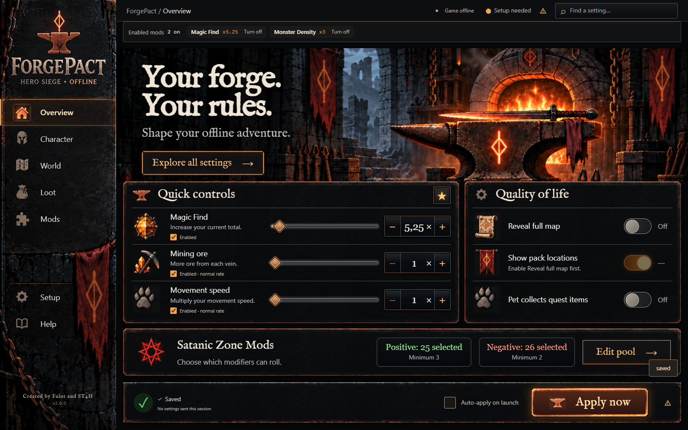
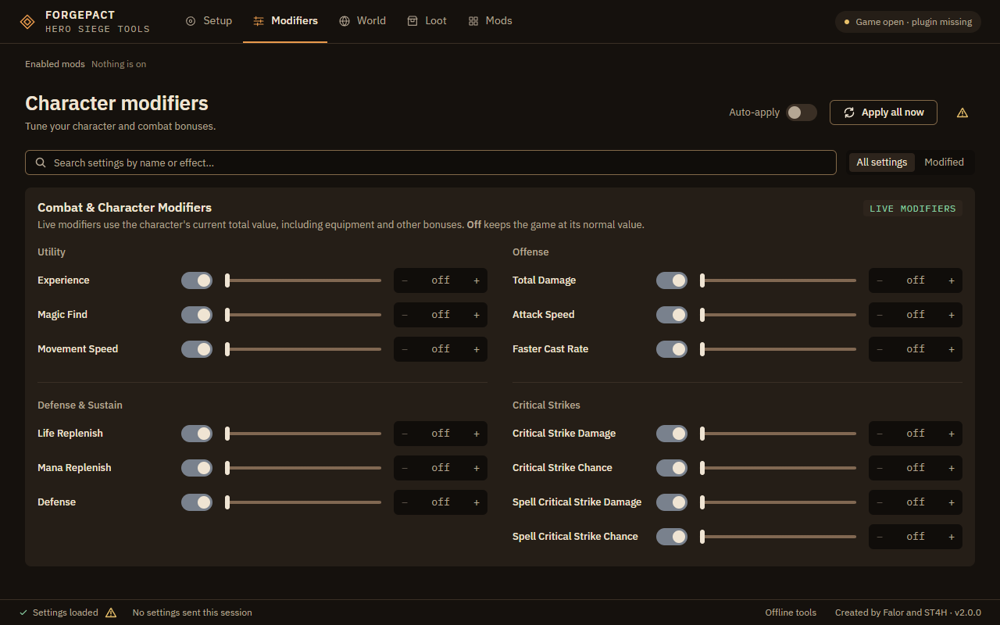
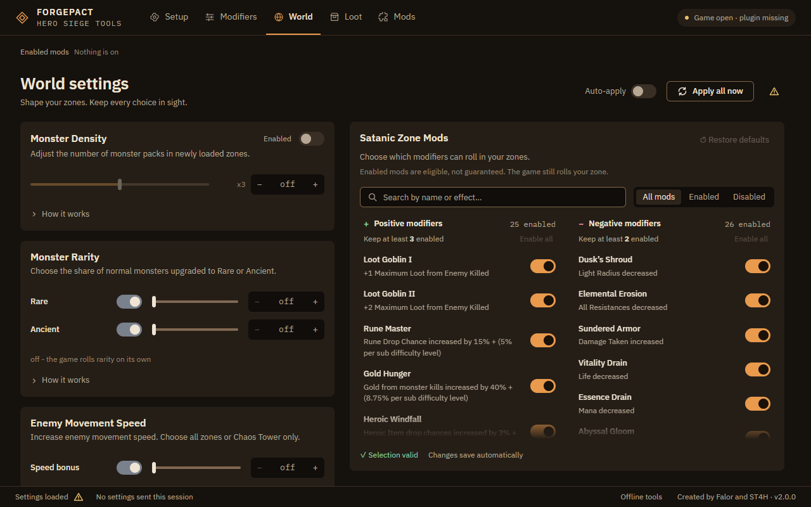
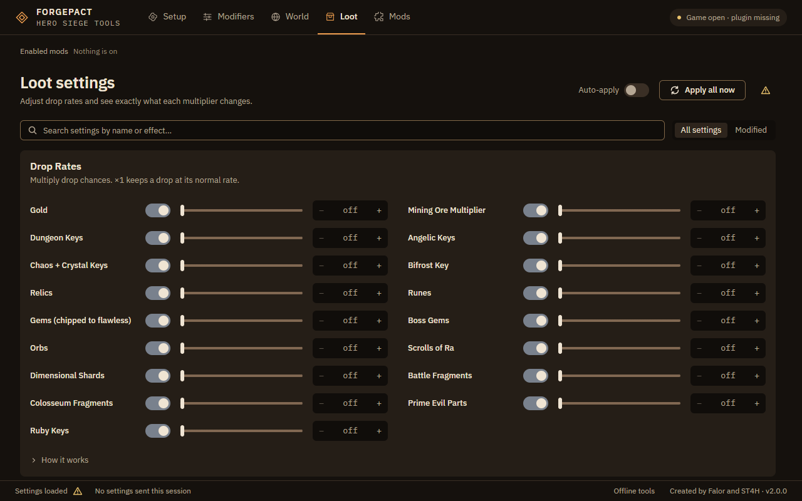
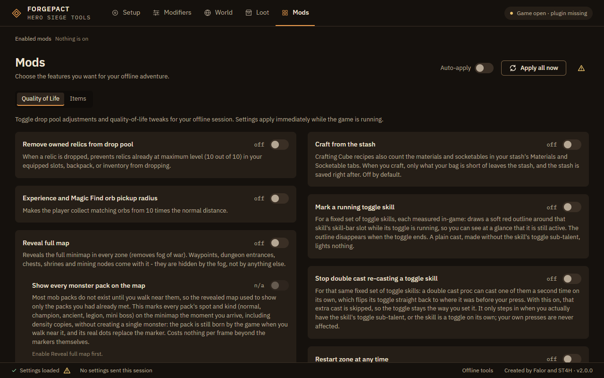
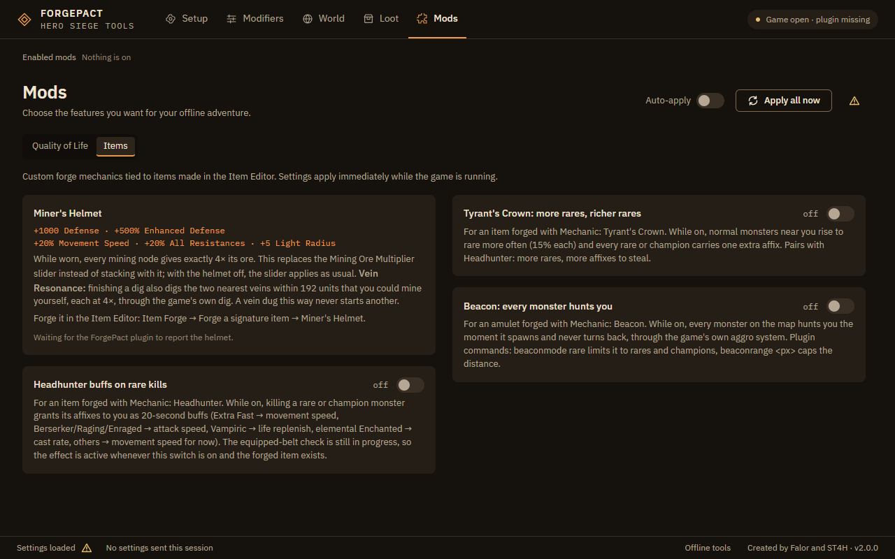

# ForgePact — Hero Siege Season 10 Offline Mod Panel

A one-click control panel for tuning your **offline, single-player** Hero Siege runs.
Set monster density, special-content rates and drop multipliers from a small local
panel; settings are applied live while the game runs and re-applied on every launch.

## ✨ Features

Dense zones are handled two ways by default: **Reveal full map** marks the
packs that do not exist yet instead of creating them, and Monster Density's
extra copies of a spawner are created over the following frames, nearest first.
The optional **Really spawn every pack on arrival (heavy)** sub-toggle, which
populates the whole zone early, still lags at high density: its v3 run at 4x
recorded latest scheduled work at 7.694 seconds and a peak frame interval of
232.430ms against a five-second target, and those counters do not prove every
group finished spawning.

The next local candidate shares caller classification within each existing
creation hook. Its production-body fixture reduced 2000 caller-object reads to
1000 per 1000 births, preserving nested enemy-chain behavior. This is a lookup
reduction, not a measured live frame-time improvement. It does not defer native
map objects, reduce density or add hooks to the player build.

The separate `build.bat profile` candidate measures nine map-generation stages
alongside AI/hunt/draw paths. Capture can start before preset-data generation;
the summary retains work before the first frame report. Player builds contain
none of these diagnostic hooks or the recorder. See
[capacity behavior and test scope](docs/population-capacity.md).

| Feature | What it does |
| --- | --- |
| **Monster Density** | 1–5× more enemies in 0.5 steps (1, 1.5, 2 …), through the game's own `Enemy_Creator` spawners |
| **Special Content** | Rift Portals, Battlefields, Cursed Orbs, Summon Portals, Chaos Pillars, Chaos Tower — up to 100× per zone |
| **Drop Rates** | Gold, Dungeon Keys, Angelic Keys, Chaos + Crystal Keys, Bifröst Key, Relics and Prime Evil Parts (Key of Terror, bosses only) — up to 100×. Gold multiplies the amount per drop: each gold drop is still one coin, worth that many times as much; the other drops multiply as before |
| **Mining Ore Multiplier** | Loot → Mining Ore Multiplier, 1–10×. Scales the stack quantity of ore awarded by mining; x1 is normal. A worn Miner's Helmet replaces it with 4× instead of stacking |
| **Miner's Helmet** | A signature helmet forged in the Item Editor. While worn: 4× ore from every mining node, and Vein Resonance - finishing a dig also digs the two nearest veins within 192 units that you could mine yourself (4× each, no chaining). Mods → Items shows whether it is worn ([details](#miners-helmet)) |
| **Angelic / Unholy Drops (Experimental)** | ForgePact's own die per kill; on a hit it builds one of its 49 real Angelic / Unholy uniques, or (since 1.4.5) Tyrant's Crown or Headhunter. x2 = 1 in 7,500 kills, each step adds a die, typable |
| **Combat Modifiers** | Total Damage, Attack Speed, Faster Cast Rate, Defense, Life/Mana Replenish, physical and spell Critical Chance/Damage |
| **Character Stats** | Experience, Magic Find and Movement Speed use the character's current total value, including equipment bonuses |
| **Full Map Reveal** | Clears fog of war in every zone, so waypoints, dungeon entrances, chests, shrines and mining nodes show immediately (toggleable; F5 in-game also toggles it). Its sub-toggle marks every monster pack on the map: most packs do not exist until you walk near them, so the map shows one marker per pack, by pack kind, without creating a single monster; the pack is born by the game when you get close and its real dots replace the marker. A second, off-by-default sub-toggle keeps the old behaviour of really spawning every pack on arrival, which costs frame time for the whole zone at high density. Markers are small icons by pack kind (ivory skull normal, hooded face ambush, magenta horned mask ancient, cyan helmet champion, gold chest colossal chest, amber skull trio legion, crowned crimson skull mini boss); spawners closer than ~96 px to each other, such as density copies, share one icon with a count badge. The icons are written to `<game>\bin\bp_ipc\packmarks\<kind>.png` on first use and never overwritten, so you can replace any of them with your own PNG (any size, transparent background; `packmarks reload` picks it up in a running game). Plugin command `packmarks` (`stat`, `icons 0|1`, `iconscale <mult>`, `reload`, `cluster <world px|0>`, `badge 0|1`, `style <kind|all> <subimage> <r> <g> <b>`, `radius <kind|all> <px>`, `fill <kind|all> 0|1`, `outline 0|1 [px]`, `alpha`, `ring 0|1`, `scale`, `list`) adjusts the look live; dots by kind are the fallback when an icon cannot be loaded |
| **Pet Collects Quest Items** | While your pet is out it walks to pick-up quest items on screen and collects them one at a time, crediting the objective through the game's own collect, and moves on from an item it cannot collect. Pick-up items only; activate/break/talk objectives are left alone |
| **Pet Moves On From Loot It Cannot Pick Up** | Off by default. With a lot of loot on the ground the game's own pet can stay on one item, hopping around it without taking it (#94). With this on, the pet moves on from loot it cannot pick up: an item it has stayed on for about 1.5 s is left alone for about 10 s and the pet goes for the rest. That hold is for items on the ground: a coin (gold) the pet gives up is only turned away from, not held back, so the pet may try it again sooner. It picks nothing up itself and does not change what the pet collects. Not yet confirmed in a live game |
| **Mark A Running Toggle Skill** | For a fixed set of toggle skills measured in-game, each either with its toggle sub-talent allocated or a toggle on its own: a soft red outline appears around that skill's skill-bar slot the whole time the toggle is running, and disappears when it stops. A skill outside that set is not covered, and a plain cast lights nothing (off by default) |
| **Stop Double Cast Re-casting A Toggle Skill** | A double cast proc can cast one of that same fixed set of toggle skills a second time on its own, flipping its toggle straight back; with this on, that extra cast is skipped and the toggle stays the way your press left it. It only steps in when you actually have the skill's toggle sub-talent, or the skill is a toggle on its own; your own presses and other skills' double casts are untouched (off by default) |
| **Restart Zone At Any Time** | The pause menu's Restart works straight away, in combat too, instead of waiting until you have been out of combat for a few seconds. Use the mouse: Restart lights up once the cursor is on it (off by default) |
| **Far Scenery Sleep** | Mods → Quality of Life, off by default. A zone's far trees, bushes, hay, rocks and fences are put to sleep, so the game stops walking them every frame, and wake again before they come into view. In Act_01_01 about 4,200 of 6,200 instances sleep and the game's own work per frame falls by about a sixth. Shrines, chests, piles, traps, walls and monsters are never touched; towns, menus and persistent rooms are left alone ([details](#far-scenery-sleep-lighter-frames-in-busy-zones)) |
| **Extra Packs As You Approach** | Mods → Quality of Life, off by default; matters only with Monster Density above 1x. Monster Density's extra spawners are made within about 3,000 px of you, and ahead of you as you move, instead of across the whole zone at once, so the far ones cost nothing until you get there. Up close nothing changes: in Act_01_01 at 5x the spawners and monsters within 1,500 px of the player were the same, while the zone held 430 spawners instead of 1,570 and the game's own work per frame fell from 84% to 70% of a 60 fps frame ([details](#extra-packs-as-you-approach-lighter-frames-at-high-density)) |
| **Timed skill countdown** | For a small set of timed skills measured and tested in-game, plus most other skills with both a duration and a real cooldown, covered by rule and untested: draws how much of the cast is left over its skill-bar slot, in one of four looks (arc / bar / number / fade), disappearing at zero. A few skills are left out where a measurement showed the timer on the skill's own object is not the skill's duration. Companion skills (turrets, totems, hydra) are not covered. A few skills whose duration is a buff on you, measured in-game, are covered too, and other buff-only skills are not. In a fight, hits can add a little time to some skills (roughly 0.2 s each in our test) and the countdown rises slightly to match. A skill switched on as a toggle never gets a countdown. Off by default; a cast already running when you turn it on shows as full until the next cast |
| **Satanic Zone Mods** | Pick which of the game's 25 positive / 26 negative World Section mods can roll onto a Satanic Zone; everything is on by default |
| **Auto-prospect** | Off by default. Every item you drag or click into the Prospect Cube's grid is prospected at once by the game's own Prospect, so the 9×6 grid stops being the limit on a batch. Before each prospect the previous prospect's batch of materials goes to your materials tab (a sub-switch, on by default), so only the newest batch stays in the grid; the item you put in, ore included, is prospected, not moved (one exception: a batch material swapped out and dropped straight back in still goes to the tab); anything left in it when the game saves is lost ([details](#auto-prospect)) |
| **Craft from the stash** | Off by default. At the game's own Crafting Cube, a recipe also counts the materials and socketables in your shared stash's Materials and Socketable tabs, so a recipe the stash covers is no longer greyed out; the game greys a recipe exactly as before, on the bag and those two tabs together. When you craft, only what your bag is short of leaves the stash - onto your bag's stack of it, into a new bag stack, or into the Cube's own grid when the bag has no room - and the game uses it up as it would from the bag; the stash is saved right after. Other stash tabs are never touched, and a move that cannot be confirmed refuses the craft instead ([details](#craft-from-the-stash)) |
| **Move all into the stash** | Mods → Quality of Life, off by default. With the stash open, click the **Move all** button, the size of the backpack's Sort button and just left of it, or press F4, and every item on the backpack tab you are looking at moves into the stash tab you are looking at, one at a time, by the game's own move for each item. When the tab fills up, the rest stay in your backpack and never spill onto another stash tab or page. A stackable joins a stack of its kind with room for it (up to 999), or starts a new stack on the same tab; on the Socketable tab a socketable joins the one stack of its kind, and a new kind stays in your backpack ([details](#move-all-into-the-stash)) |
| **Gems of Incarnation** | Loot → Gems of Incarnation. Off by default. Every Gem of Incarnation that drops is Mythic, with 4 or 5 mods, rolled by the game itself - and with a filter, with the mods you ticked; every mod on every Gem of Incarnation shows the highest value its best tier can roll. Two switches and a mod filter, nothing written to your save ([details](#gems-of-incarnation)) |
| **Remove Owned Relics** | A relic you already own at 10/10, worn or in the backpack's relic tab, stops dropping: when the game picks it, it picks again, so another relic drops in its place and every other relic keeps its usual odds |
| **Auto-apply** | Saved settings are re-sent every time the game starts |
| **Frame profiler** | Plugin command `frameprof start [seconds]`: measures what the game spends its frames on - frame times, the heaviest events, scripts and built-ins, what ran during each slow frame, CPU per thread - and writes a report to `bp_ipc\perf`; `tools/frameprof_report.py` turns it into a page. Changes nothing in the game; costs nothing until started ([details](#frame-profiler-where-the-games-frame-time-goes)) |

ForgePact does not write permanent stat changes into your save or modify the game exe
for individual settings. Features are resolved by script/object name and applied in
memory while the offline game is running. Turning a modifier off restores its normal
value for that session.

High multipliers are throttled automatically. Extra spawn markers are queued and created
a few per frame instead of all at once, and creation pauses while the room is at its
heaviest (during a zone load the game briefly passes through 20–30k instances before
settling). Without this, high settings crashed the game on zone entry.

Drops are **not forced**. Every multiplier feeds the game's own dice: an item's
`droprate.base` is a "1 in N" value, so `x5` divides it by five — five times more
likely, still random, still capped by the game's own rules. The vanilla value is stored
on first touch, so moving the slider twice never compounds. `x1` restores vanilla
exactly.

**Mining Ore Multiplier** is a separate quantity control, not a drop-chance multiplier.
It changes the amount of Copper, Iron, Gold, Ruby, Jade or Tarethium ore in a
normal mining reward. It preserves the chosen ore type and is scoped to the
mining call. By design it rewrites only the ore stack's quantity, so mining XP,
gems, prospecting and monster loot are left to the game. It installs its two
native hooks only when raised above x1, and uses the original
reward unchanged if it cannot validate the reward parameters. Checked in play on
2026-09-23: at x10 a 6-ore reward dropped 60. A worn [Miner's Helmet](#miners-helmet)
replaces it with 4×. See [research and test scope](docs/mining-ore-research.md).

Dungeon Keys, Angelic Keys and Relics are also gated a second time: outside their home
zone the game rolls their drop type at zero chance, so the item can never come up no
matter how good its rate is. ForgePact opens that outer roll for those three families
when you raise them — using the monster's **own** key chance as the base, never a fixed
number; Prime Evil parts, which share the relic roll, are skipped. Every other family
(runes, gems, orbs, scrolls, shards, fragments, ruby keys, Prime Evil parts) only scales its
own roll where the game already drops it, so zone rules stay intact.

**Prime Evil Parts (Key of Terror)** are Gurag's Soul, Death's Sigil, Damien's Eye, Anubis'
Ankh, Karp King's Bellybutton, Satan's Horn and their infernal versions. They come from
bosses, so this slider works on bosses only, and it never touches Relics.

Checked in play on 2026-09-26: Karp King was killed through the game's own death path, and
dropped about 0.7 bellybuttons per kill at x1, 3 at x5 and 9 at x35. Above x35 nothing more
changes. Uber bosses (Damien, Reaper, Endrixia, Anubis) dropped no Prime Evil part, even at
x35. The game's uber drop script (`DropUberParts`) makes Souls, Scrolls of Ra and Colosseum
Fragments and reads no drop rate, so the slider cannot scale it. See
[research and test scope](docs/prime-evil-parts-research.md).

### Using the panel

The default **Ember Forge** theme uses the approved forge artwork and a sidebar:
**Overview**, **Character**, **World**, **Loot**, **Mods**, **Setup** and **Help**.
Overview has customizable quick controls; **Find a setting** / Ctrl+K searches
every section, including Mods switches and Theme, and focuses the chosen control.
All 2.0 settings and their on/off switches remain available.
Long pages have a visible scrollbar and support the mouse wheel and keyboard.
The bottom action bar keeps its own space, so it cannot cover the final settings.
Undo has its own row in that bar; long setting names wrap without hiding Apply.

Ledger, Graphite and Sigil remain available in **Setup → Appearance → Theme**,
with their horizontal tabs. Your explicit theme choice is preserved.


See [Ember integration and source instructions](docs/ember-ui.md). The header shows
whether the game is running and whether your latest setting has saved. **Auto-apply**
and **Apply all now** keep their existing behavior.

The screenshots below are the panel at 1280 wide in the alternative **Ledger** theme,
taken from the test sandbox, which reports the game open without the mod plugin
(hence the warning icon).


**Modifiers**: the character multipliers in four groups (Utility, Offense, Defense & Sustain, Critical Strikes), each slider with its own switch.


**World**: Monster Density, Monster Rarity and Enemy Movement Speed beside the Satanic Zone mods.


**Loot**: the drop-rate multipliers, keys included, each with its own switch.


**Mods › Quality of Life**: every mod not tied to a forged item, one card each.


**Mods › Items**: the Miner's Helmet and the Custom Forge mechanics for items made in the Item Editor.

Every slider has **− / +** buttons and an editable value. Click the value, or focus
it and press Enter, to type an exact number; Enter applies and Escape cancels.
Saved decimal values are retained after reopening the panel. Disabled Monster
Density shows **off**; enabling it restores the saved multiplier. Search
**Modifiers** or **Loot**, or choose **Modified**, to find changed settings quickly.
These filters never alter your settings. **How it works** expands the full details
for density, rarity, special content and drops.

Setting names now have matching icons: coin stacks for Gold, distinct portals
and towers for special content, different key families, and combat/stat symbols.
Satanic Zone modifiers use the same visual families. Names remain visible; the
icons do not replace descriptions or selection checkmarks. All artwork is
embedded locally and stays sharp at different display scales.

**Mods** groups related switches in cards. The sidebar shows only the five
main sections: Setup, Modifiers, World, Loot and Mods. The Mods page itself
has two sub-tabs at the top, and each mod sits in its own card: **Quality of Life**,
everything that is not tied to a specific forged item (the relic drop pool
filter, orb pickup radius, map reveal, pet quest pickup, auto-prospect, the
toggle marker/guard and the timed skill countdown), and **Items**, the custom
forge mechanics tied to items made in the Item Editor (Headhunter, Tyrant's
Crown, Beacon). Quality of Life opens first; clicking the other sub-tab (or
using the arrow keys) switches which set of mods you see, and the panel remembers
the one you last had open until you close it. Map population depends on
Reveal full map; its switch is unavailable while the parent is off. All
settings still use the existing local configuration and game plugin. The
panel adds no UI dependencies.

**Enabled mods**, just under the Apply controls, lists every mod you have
turned on, with its current value, and says how many are on (**Nothing is on**
when none are). Each entry has a **Turn off** button that switches that mod
off exactly as its own control would, and the entry disappears. Settings that
are only options of another mod (map population, the auto-prospect material
move, the gem mod filter) and the Satanic Zone modifiers are not listed.

Every slider now has its own on/off switch, like Monster Density's. Turning a
slider off keeps the value you set, while the game plays as if the slider were
at its default; its value box reads **off**. Turning it back on sends your
value again, and Apply all leaves a switched-off slider at the default.

**Theme**, in the **Appearance** card at the end of the Setup tab, picks the
panel's colour theme: click it (or press Enter on it) and a short list opens
with a small colour preview of each theme. Your choice is saved with the panel's other settings, so it is still
there the next time you open ForgePact.

The icon pack (the SVG sprite and which setting uses which icon) lives in
`panel/src/icons.js` and is compiled into the panel's page by `npm --prefix panel
run build`, so a packaged panel carries it with no separate file. To export the
69 individual SVGs and an offline preview gallery, run from the ForgePact folder
(after `npm --prefix panel ci`; a relative path resolves against the folder you
run it from):

```powershell
npm --prefix panel run icons -- "C:\path\to\ForgePact-Icon-Pack"
```

Special content is spawned through the game's **own** mechanic: ForgePact multiplies
the `Spawn_<Name>_obj` marker objects and opens the shared `eSt` gate, then the game
places and runs the mechanic itself. Nothing is faked or hand-placed.

**Chaos Tower and Shadow Realm** need one extra step: the game rolls for them once
per run and then latches a flag so they can never appear again. ForgePact clears
that flag right before each zone's markers activate, so every fresh zone gets its
own honest roll.

**Chaos Tower** and **Shadow Realm** are once-per-run mechanics. Their activation code
reads persistent flags (`Controller_obj.shadowRealmSpawned`, the protected
`chaosTowerStarted` / `chaosTowerSpawnZone`), so multiplying the marker alone changes
nothing after the first copy. While either slider is above x1, ForgePact resets those
flags immediately before each marker copy activates; the game's own placement, roll and
object creation then run unchanged. Both also carry a difficulty gate (Shadow Realm
needs the third tier or higher, Chaos Tower the second) — with the slider on, that single
check is satisfied for the duration of the activation call only, so both can appear on
every difficulty. Verified live on 2026-09-03: two markers gave two Shadow Realm portals
and two Chaos Towers in one zone.

### Enemy Movement Speed
**World → Enemy Movement Speed** adds 0-300 % to how fast monsters run at you, which is the
quickest way to shorten Chaos Tower waves. The plugin hooks `PathFindStartPath`, the single
place the game turns an enemy's base speed into path speed
(`moveSpeedCur = moveSpeed × movementSpdMultiplier` → `path_start`), and scales the base speed
only for the duration of that call: the walk animation stays in step, slows and debuffs still
apply on top, and nothing compounds. **Only inside Chaos Tower** (default on) keeps every other
zone vanilla; goblins and online client movement use their own movement code and are not
touched. Command: `enemyspeed <multiplier> [ct|all]` (`enemyspeed 1.5 ct`), `enemyspeed` alone
prints the status with path-start and applied counters.

### Signature drops
Tyrant's Crown (Great Helm) and Headhunter (Heavy Belt) are two more items in the **Angelic /
Unholy Drops** pool above: they drop from the very same die as every other item in it, such as
**Liquor Holster**, at exactly the same rate - so they never drop while that slider is off (the
default), and more often as it is raised, along with everything else in the pool. They are not
part of the game's own Angelic roll (the Blood Pact / dungeon "Angelic item drop chance" effect) -
only ForgePact's own die drops them. They arrive as SS-tier Unholy items, fully set up, and the
plugin recognises them on every load even without the Item Editor. `sigdrop status`,
`sigdrop crown`, `sigdrop belt` and `sigdrop off` are a test command that forces every kill
to drop the named item (or turns that off); it does not change the normal drop rate, which
always follows the Angelic / Unholy Drops slider.

### Tier (Custom Forge)
A forged item can carry a Tier letter (`tier=1` C … `tier=5` SS in the runtime file; the Item
Editor 2.15.3 offers it under Appearance). It is the letter the tooltip prints and the value loot
filters use.

### Headhunter (Custom Forge mechanic)
Forge any item in the Item Editor with **Mechanic: Headhunter** and switch on **World →
Headhunter** in the panel. Killing a **rare or champion** monster then grants its affixes to
you as 20-second buffs, through the game's own on-kill dispatcher and `BuffAdd`:

| monster affix | buff you gain (20 s) |
|---|---|
| Extra Fast | movement speed |
| Berserker, Raging, Enraged, Extra Strong, Punisher, Sharpshooter, Multishot, Burst Shot | attack speed |
| Vampiric, Venomous | life replenish |
| Fire Enchanted, Pyromaniac, Blazing, Meteoric | fire skill damage |
| Lightning Enchanted, Thunder Caller | lightning skill damage |
| Cold Enchanted | cast rate (no cold-damage buff id measured yet) |
| Arcana's Curse, Possessed | arcane skill damage |
| Manaburn | mana replenish + arcane damage |
| Stoneskin, Thick Skin, Magic Resistant, Antimagus | physical + magic damage reduction |
| Shielding, Fearless, Divine, Fallen Angel | defense |
| Colossal, Champion, Commander, Guardian of Hell, Bloating | max life + max mana |
| Stealthy, Time Lapsing, Wasped, Haunted | dodge |
| Treasure Gobbler | magic find |
| Fractal | experience gain |

**Head labels.** Every stolen affix floats above the character's name bar in gold with its
seconds left (`Extra Fast 17s   Vampiric 19s`, three per row), so you can see what you took
without opening the buff bar. The labels are drawn right after the game's own HUD buff row
(`DrawHudBuffs`) and projected through the active camera, so they follow the character at any
resolution. Commands: `hhlabel on|off`, `hhlabeloffset <px>` (height above the head, default
150), `hhlabelmax <n>` (labels kept, default 12, oldest drops first), `hhlabelfont <index|off>`.

Commands: `headhunter on|off|force|status`, `hhdur <seconds>`, `hhmap <affix> <buffId> [v0] [v1]`,
`hhdefault <buffId>|off`. The panel sends `headhunter force` at every game start while the switch
is on; `force` also stands in for the equipped-item check, which is not finished yet.

### Tyrant's Crown (Custom Forge mechanic)
Forge a helmet in the Item Editor with **Mechanic: Tyrant's Crown** and switch on **World →
Tyrant's Crown** in the panel. While it is on, monsters that spawn near you rise from normal to
**rare** with a 30 % chance (they get two affixes), and every rare or champion carries **one more
affix**. Ancients and bosses are never touched.

How: `EnemyRaritySettings(typeId)` runs from `Enemy_Parent_obj` Alarm 4 with the monster as
self, after the spawner decided `enemyRarity` and filled `enemyAffix` / `affixList`, but before
the stats, affix effects and the health bar are built (live-traced 2026-09-05: entry and exit
state identical). ForgePact changes the rarity and the affix flags at its entry, and the game
builds the monster exactly as if it had rolled that way — yellow name, affix labels and affix
behaviour included. Only live-confirmed affix indices are handed out. Live test: 847 monsters,
259 raised, 354 extra affixes, no crash.

**Rare monsters hunt you.** While the crown is on, every rare or champion also uses the Beacon's
hunt rules (see below): a map-sized aggro range, no leash, and it is kept awake inside the
`beaconwake` radius, so rares come for you from across the zone while normal monsters keep the
vanilla rules. Live check 2026-09-05 at the default 15 %: 243 monsters seen, 30 raised to rare,
64 extra affixes.

Commands: `tyrant on|off|force|status`, `tyrantchance <pct>` (normal → rare, default 30),
`tyrantaffix <pct>` (extra affix on rares/champions, default 100). The panel sends `tyrant force`
at every game start while its switch is on. Research build: `raritytrace <n>` logs entry/exit
state of the next n monsters.

### Beacon (Custom Forge mechanic)
Forge an amulet in the Item Editor with **Mechanic: Beacon** and switch on **World → Beacon**
in the panel. While it is on, **every monster on the map hunts you** the moment it spawns, and
none of them turns back.

How: an idle monster runs `PathFindScanTick` every few frames: `instance_nearest` finds the
player and, if `point_distance` is below the monster's **`distance`** variable (300 px vanilla;
`aggroRange` is a different value), `PathFindTakeTarget(player)` sets the target and
`PathFindAggroBroadcast` wakes the pack. In chase state `PathFindLeashCheck` drops the target
when the monster strays too far from home. ForgePact hands every scanning monster a map-sized
`distance` (and `aggroRange`; the vanilla values are kept in `fp_distance` / `fp_aggroRange` and
restored when the hunt is off) and skips the leash check; the game's own scan, target and pack
code does the rest, so the behaviour is the vanilla one, only without the distance limit.
Verified 2026-09-05 with the crown: 32 rares chasing at once, 65 monsters widened, 14 700 leash
checks skipped, packs following their rare leader through the game's own broadcast.

**Wake radius.** The game freezes every instance outside the players' view boxes each frame
(`ActivateDeactivateProps` from `Controller_obj` Step), and a frozen monster never scans, so on
its own the range change only reaches monsters near the screen. After that call the Beacon
re-activates every monster (and every `Enemy_Creator*` spawner) within `beaconwake` px of the
player (default 4000 ≈ 3-4 screens) and puts the ones beyond back to sleep, so everything inside
the radius keeps hunting. `beaconwake all` keeps the whole map awake (watch the frame rate in
dense zones), `beaconwake off` leaves the game's own freezing alone, `beaconwake creators off`
stops waking spawners.

**How far "hunts you" reaches.** The game steps monsters from `Controller_obj` through
`EnemyStepHandleNew` and its `monsterHandleArray`, and monsters beyond roughly 1500 px never get
an AI tick even while active (measured: zero scans from farther away, with or without the freeze
pass). So hunted monsters come for you from anywhere inside that update zone (about 1.5 screens,
far beyond the vanilla 300 px) and keep coming once they have you; monsters still farther out
wait until they enter the zone. Forcing their AI tick from the plugin (`beaconfarstep on`,
experimental) crashed the game on zone entry and ships off; `beaconwake every <n>` (default 6)
runs the game's freeze pass every n frames while a hunt is on.

**Spawn as if approached (experimental, off).** The spawner's periodic check (decompiled) calls
`distance_to_object(Player_obj)` and spawns its pack (`alarm[2]`) below 1050 px. `beaconspawn on`
makes that builtin answer 0 to every awake spawner; live it produced no extra packs in the tested
zone (those spawners had already spent their pack at zone load), so it ships off by default.

Commands: `beacon on|off|force|status`, `beaconrange <px>` (default 1000000 = whole map),
`beaconmode all|rare` (rare: only rares and champions hunt you), `beaconwake <px>|all|off`,
`beaconwake creators on|off`, `beaconspawn on|off`. The panel sends `beacon force` at every game
start while its switch is on. Research build: `aggrotrace <n>` logs the target events (take / set /
broadcast) and the scan variables of each monster type, `spawntrace <n>` samples the spawner
checks, `creatorprobe` counts awake spawners.

### Custom Forge identity: name, special affix, description
A forged item's sidecar line can carry three identity extras next to its stats; the Item
Editor (Item Forge → Identity) writes them and the plugin applies them when the item's
struct is created:

| extra | where the game shows it | how it is applied |
|---|---|---|
| `name=` | the tooltip title | written over `itemInfoStruct["28"]` after the game localized it; the magic prefix/suffix fields `["5"]`/`["4"]` are blanked so the item is shown under exactly that name |
| `affix=` | gold rows above the stat list (up to 3 lines) | the struct is tagged `fp_affix`; hooks on `DrawInventoryItemV2` / `DrawInventoryStatsNew` draw the rows in front of the first real stat row and return the added height, so the stats, lore and the box move down with it (see below) |
| `lore=` | the italic description under the stats | private localization key in `itemInfoStruct["29"]` |

**Base stats for the Item Editor.** While the Custom Forge hooks are active the plugin also records
the finished `itemStatStruct` of every item the game builds (keyed by `itemTimeStamp`) and writes
`bp_ipc\itemstats.json` at most once every two seconds. The Item Editor reads it to list an owned
item's exact stats — rolled affixes included — as editable base rows in the Item Forge; without
the file it falls back to its own tooltip model (base rows only) and says so.

Headhunter items without an `affix=` show the built-in line *Steals the affixes of slain
rare monsters for 20s*.

How the affix rows fit in: `DrawInventoryItemV2(x, y, scale, item, …)` draws the whole
inventory tooltip and calls `DrawInventoryStatsNew(x, y, item, statId, label, format, style,
…)` once for every known stat. That helper draws a row only when the item has the stat and
returns the row height (30) or 0, and the caller adds the return value to its y cursor. The
plugin draws its rows at `y`, hands the game `y + rows·30` for its own row, and returns both
heights, so nothing overlaps and the box grows by exactly the rows added.

### Satanic Zone Mods
**World → Satanic Zone Mods** lists every World Section modifier Hero Siege can put on a
Satanic Zone — 25 positive (buffs) and 26 negative (debuffs), names and descriptions from
the game's own data. Everything starts enabled; deselecting one keeps the plugin from
letting a future zone roll it, while the game still rolls the rest itself — nothing is
forced. Positive mods keep a minimum of 3 enabled, negative mods a minimum of 2, since a
Satanic Zone still needs a pool to draw from. Plugin command: `satmods <buff|debuff> <csv
of disabled ids>`.

Click anywhere on a modifier card to enable or disable it. Checked green cards are
positive modifiers; checked rose cards are negative modifiers. Search by name or
effect, or use **All mods / Enabled / Disabled** to narrow the lists. The counters
always show the entire enabled pool, including modifiers hidden by a filter.
At the minimum, enable a replacement before removing another modifier; the panel
explains this next to each list. **Enable all** restores a whole column, including
filtered-out entries. **Restore defaults** enables both pools and leaves every
other ForgePact setting alone. Changes save automatically; existing selections
are retained when reopening the panel. Pending saves lock further pool edits,
and a failed save reads back the stored selections and displays an error.

The lists scroll independently, stack on narrow screens, and support Tab/Space
keyboard selection. These controls change only the eligible pool, not the number
of modifiers that the game rolls.

No single game routine could be pinned down as "the roll" (see the research doc), so this
does not hook one: a poll running every 15 frames off the plugin's existing frame callback
watches `Controller_obj.satanicZoneBuff`/`satanicZoneDebuff` and, the instant either array's
content changes, swaps out any id you disabled for a random still-enabled one — live-tested
correcting a disabled id within one poll tick, leaving every enabled id untouched.

The buff/debuff table lives in [`hs-game-sdk/curated/satanic_zone.json`](../hs-game-sdk/curated/satanic_zone.json)
(hand-verified game knowledge, not extracted from the binary) and is shared with the rest
of the toolkit through the generated `hs_game_sdk` bindings — see
[`tools/generate_satanic_zone_sdk.py`](../tools/generate_satanic_zone_sdk.py). Full method
and live findings are in
[`docs/satanic-zone-mods-research.md`](docs/satanic-zone-mods-research.md).

## Remove owned relics from drop pool

Mods tab → Quality of Life. While it is on, a relic you already own at 10/10 no longer
drops. That covers relics worn in a relic slot and relics kept in the backpack's relic
tab. When the game picks one for a relic drop, it picks again, so another relic drops
in its place.

Whether a relic drops at all is untouched. Every relic you can still level keeps the
same odds as without the mod: the game picks among them exactly as it always does,
only without the ones you have maxed. If every relic that can drop is already at
10/10, the filter stands down, since there is nothing left to drop instead. Turning
the toggle off restores vanilla behaviour for the session.

**How it works.**
- Every relic the game drops comes from a draw the game repeats while the relic it
  drew is a quest relic (`GetRelicQuest`). That includes ordinary kills and both
  Satanic zone kill rewards. ForgePact answers "quest relic" for your 10/10 relics as
  well, so the game's own draw skips them.
- Before 2.1.0 the filter changed each maxed relic's drop rate instead, and the relic
  pick never reads that value. Its log said `holding back`, and the relic still
  dropped (#125).
- Now and then the game drops a copy of one of your equipped relics, to help you level
  it. It never copies one that is already at 10/10.

The panel sends `relicfilter 1`, which only **arms** the mod. The `GetRelicQuest` hook
goes in later, once a player instance exists. Installing a hook during character
selection stalled the runner for about a minute (measured 2026-09-09), so the plugin
defers it to its frame callback. That is why the mod applies a moment after you are
in-game rather than at launch.

The plugin reports what it is doing in `<game>\bin\bp_ipc\out.txt`:

```
relicfilter -> ON (armed, applies once you are in-game)
relicfilter: hook installed -> ON (GetRelicQuest, native detour)
relicfilter: scan found 1 maxed relics (ids 140)
relicfilter: equipped slots mplr=1 slots=18 ... relics=12:140@10 ... stopped=none
relicfilter: relic tab key=1 profile=0 online=no grid=156 cells=156 nodes=14 strings=14 ... maxed=none stopped=none
relicfilter: skipped maxed relic 140, the game picks again (1 since armed)
```

`out.txt` no longer keeps every session forever. Once it passes 2 MB, the plugin
rotates it to `out.prev.txt` the next time the game starts (never mid-session) and
replaces any older `out.prev.txt`. Old logs no longer pile up, and the previous log is
never lost. The log still grows during a session, so one long session can make either
file larger than 2 MB. **If you're attaching a log to a bug report, attach both
`out.txt` and `out.prev.txt`.** The session you actually want may be the one that was
just rotated into the `.prev` file, for example when the game crashed and you
relaunched before sending the report.

| Line | What it means |
| --- | --- |
| `hook installed -> ON (GetRelicQuest, native detour)` | The hook is in and can act |
| `hook installed -> FAILED (...)` | The filter cannot act on this game build. The reason is in the brackets |
| `scan found N maxed relics (ids ...)` | Printed once when the filter arms: the relics it will skip. The two lines after it say what the equipped slots and the relic tab held, and `stopped=none` means each was read in full |
| `scan did not run (no player yet)` | No character was found when the filter armed |
| `skipped maxed relic N, the game picks again (K since armed)` | Working: the game drew relic N and drew again. The first 20 are listed one by one, then every 100th |
| `every droppable relic is maxed, filter stands down (nothing left to drop instead)` | Every relic that can drop is at 10/10, so the filter lets the game's pick through |

`relicfilter status` prints the hook's state and how many maxed relics were skipped
since the filter was armed. A session with relic drops and no `skipped` line can mean
you own no relic at 10/10, or that none of your maxed relics came up. The arm lines
and `relicfilter status` tell those apart.

`tests/test_relic_filter_behavior.py` runs the real hook through the game's own draw
against every line in this table.

### Known limitation — The Abyss
`Spawn_Abyss_obj` is **not** supported. It is the only mechanic in its family that
sets `discoverable = true`, which puts it behind a two-stage discover-then-activate
gate. The mechanic can be made to run, but it still declines to place its objects for
a reason we have not identified. Details and every ruled-out hypothesis are in
[`docs/S10-special-content-notes.md`](docs/S10-special-content-notes.md).

## Auto-prospect

Mods tab → Quality of Life → **Auto-prospect items put in the Prospect Cube**. Off by
default. The cube's 9×6 prospect grid fills long before a full inventory is through
it; with this on, every item you drag or click into the grid is prospected straight
away by the game's own Prospect, exactly as if you had pressed the button.

- **The previous batch goes to your materials tab.** A Prospect leaves one single-cell
  stack per material type in the grid. With the sub-switch **Move the previous materials
  to your materials tab** (on by default under Auto-prospect; `autoprospect bag 1|0`),
  each new insert first moves the materials the previous prospect made to your materials
  tab - the game's own stack move, the one a click on a material makes - and then
  prospects, so only the newest batch stays in the grid. Only that batch moves: what
  moves is what ForgePact's own last prospect produced, and of that only materials,
  identified by their item type. The item you put in is prospected and not
  moved, ore included, and a material you put in the grid yourself stays - with one
  exception, not seen yet: a batch material you swap an item onto and drop straight
  back in is still part of the batch, so it goes to the tab instead. After the
  cube is reopened, Auto-prospect is turned off and on, something is taken out of the
  grid, or the grid changes without an insert landing, ForgePact forgets the batch and
  the next prospect moves nothing. A material with no stack in the materials tab yet
  (the first of its kind) takes the route the game's own click takes for it: the game's
  preferred grid for the item, then a place into it - measured landing in the main bag,
  not the materials tab. A material
  the game will not take stays in the grid, and the reason is logged once each:
  `autoprospect: no-preferred-grid - …` (the game named no grid for a new type),
  `not-placed` (the place was not confirmed), `not-added` (the stack add was not
  confirmed) or `move-failed` (the move could not be made or checked; the line
  names the step that failed); a refusal has not been observed yet (a full bag or
  materials tab was not tested). A material is
  cleared from the grid only after the game reports the move succeeded; if one leaves
  the grid without that (`vanished`), or the grid cannot show it gone after it
  (`cell-kept`), the move turns itself off for the session and says so. With the
  sub-switch off, materials stay in the grid as after a normal Prospect.
- With fewer than 6 free cells, auto-prospect holds back and leaves the item in the
  grid; the first time in a session it writes
  `autoprospect: grid-full - holding back - N free cells, needs 6; empty some of the grid`
  to `bp_ipc\out.txt`.
- **Anything still in the prospect grid when the game saves is lost.** The game
  itself does not keep that grid across a save (measured with an unmodded grid: items
  left there were gone after a save and a relaunch). With auto-prospect on, the newest
  batch of materials sits in the grid, so empty it before you leave the cube.
- ForgePact runs the game's Prospect, and its stack move, at a moment the game did not
  choose. The Prospect was tested with junk items; the move to the materials tab is
  being re-tested on this build (an earlier build also moved an inserted ore back to
  the tab unprospected). Prospecting an ore only has a chance of giving materials - the
  game's own Prospect, pressed by hand with the mod off, used an ore up and gave nothing
  on the same call that gave materials before - so an ore that vanishes with nothing in
  its place is the game, not the mod. Back up `%LOCALAPPDATA%\Hero_Siege` first.
- It says what it did. If the hook it needs cannot see the game's own inserts, it turns
  itself off with an `autoprospect: hook TABLE-ONLY -> OFF` line; otherwise
  `autoprospect: hook installed -> ON`, and `autoprospect: first prospect - …` once the
  first item has turned into materials, and `autoprospect: first move to bag - …` once
  the first batch has gone to the materials tab. If a Prospect it runs leaves the grid unchanged,
  it says that once too: `autoprospect: the Prospect ran but the grid did not change - …`
  (or `… could not be read afterwards - …` when it could not check).

How it works, and the research that proved ForgePact can run the Prospect itself, is in
[`docs/prospect-window-research.md`](docs/prospect-window-research.md) (§ Stage B; the
move to the materials tab in § Stage C; first-of-its-kind materials and the ore finding
in § Stage D).

## Restart zone at any time

Mods tab → Quality of Life → **Restart zone at any time**. Off by default.

The pause menu's Restart normally refuses while the game counts you as in
combat, and only works once you have been out of combat for a few seconds.
With this on it works straight away. ForgePact does not restart anything
itself: while the mouse is on Restart, it changes the one value the game
uses to grey the button out, inside the game's own call for the button under
the cursor, and the game's own Restart does the rest. The game sets that
value again every frame, so in combat the button still looks greyed until
the cursor is on it, and moving the mouse away puts the wait back.

- **Mouse only.** Keyboard navigation does not reach the pause menu's
  buttons, and a controller has not been tried.
- **Enemies nearby.** A restart while enemies are alive and attacking is
  accepted as the player's choice; the game's own Restart handles it.
- `restartanytime stat` prints `written=` (frames the in-combat wait was lifted),
  `passed=` (Restart was already allowed), `otherNode=` (another button had
  the cursor), `unreadable=` (the button's value could not be read, so
  nothing was written) and `hook=`.

How the value was found, over three research rounds, is in
[`docs/restart-always-available-research.md`](docs/restart-always-available-research.md).

## Craft from the stash

Mods tab → Quality of Life → **Craft from the stash**. Off by default.

The Crafting Cube counts only what is in your bag, so a recipe stays greyed
out while what it needs sits in your shared stash. With this on, a recipe also
counts what the stash's **Materials** and **Socketable** tabs hold, and the
game greys a recipe exactly as it does today, on the bag and those two tabs
together. ForgePact does not craft anything itself:

- **At the craft**, only the amount your bag is short of moves out of those
  tabs, by the game's own routines: onto your bag's stack of it, into a new
  stack in the bag, or into the Cube's own grid when the bag has no room. The
  game then uses it up exactly as it would from the bag. A shortfall that
  spans several stash stacks empties whole stacks first.
- **The stash is saved** right after the craft, the way closing the stash
  saves it. Your character is saved by the game as usual.
- **Never a source:** the ordinary stash tabs, the guild stash and the Unique
  tab.
- **Refused, not guessed.** If a move cannot be confirmed on both sides, or a
  recipe's amounts cannot be read, the craft is refused and the log says
  `refused`. If the game's craft did not use up exactly what it needed, the
  mod turns itself off until the game is restarted (`consume mismatch`), and
  so does a move that could not be put back (`off for this session`).
- Each craft that moved something writes one line to the log naming the
  units, the material, the tab, where they went and whether the stash was
  saved, for example `craftmats: moved 2 class=15 b=1 from socketable to
  bag-stack; saved=yes`.

How the game counts, consumes and saves was measured over several research
rounds, in
[`docs/crafting-materials-research.md`](docs/crafting-materials-research.md);
its `## Ship design` describes this mod and what has not been observed live.

## Move all into the stash

Mods tab → Quality of Life → **Move all into the stash**. Off by default.

With the stash open, click the **Move all** button - it sits where the game
shows its own **Mercenary** button when the backpack is open on its own, just
left of the backpack's **Sort** button, and looks like the backpack's **Sort
Tab** button, while the switch is on - or press **F4**, and every
item on the backpack tab you are looking at moves into the stash tab you are
looking at, one item at a time,
top-left first, row by row. Each item goes by the game's own move for it -
the same routines a Ctrl + left click runs, called in the same order - so it
lands exactly as a hand move would have put it, and the stash is saved when
you close it, as after a hand move. ForgePact writes nothing into the stash
itself.

- **When the tab fills up**, the first items that fit move and the rest stay
  in your backpack. They never spill onto another stash tab or page: an item
  is only ever handed to the tab on show, and only after that tab has been
  read to have room for it. The log names each item that stayed and why
  (`no room on the shown tab`).
- **Which tabs.** Any Personal or Shared stash page, from the backpack page
  on show. The **Materials** tab, from a backpack page or from the
  backpack's Materials view. Anything the tab does not take (the Materials
  tab takes only materials) stays in your backpack.
- **Stacks.** A stack in the stash holds up to 999, and the Materials tab
  (like a stash page) can hold several stacks of one kind. A stackable item -
  a material, a key - joins a stack of its kind that still has room for its
  whole count, the way the game's own Ctrl + left click does; when every
  stack of its kind is too full to take it, or the tab has none, it starts a
  new stack in a free cell of the same tab. It is never split between two
  stacks, and with no free cell it stays in your backpack (`no room on the
  shown tab`).
- **The Socketable tab**, from the backpack's Socket view only. That tab
  holds one stack per kind: a socketable whose kind is already on the tab
  joins that stack, whatever its count, and one whose stack is full stays in
  your backpack (`its stack on the shown tab is full`) - the tab never gets a
  second stack of a kind. A kind the tab does not have yet stays in your
  backpack (`a new kind stays in the bag`), because which empty slot of the
  tab takes which kind has not been worked out. The game itself refuses
  jewels and Gems of Incarnation on that tab, and they stay too.
- **Not supported yet:** the Unique tab, and the backpack's Key, Tarot and
  Relic views. The button and F4 there move nothing, and the log says
  `refused`. A stackable item whose stack on a Shared page cannot be
  identified stays in your backpack too.
- **Refused, not guessed.** If a move cannot be confirmed afterwards - the
  item not where the game said it put it, or still in your backpack as well,
  or the stash tab on show changed - the run stops, ForgePact takes the item
  back out of the stash tab when it can, and the mod turns itself off until
  the game is restarted (`off for this session`); the panel then shows
  `off (this session)` beside the switch.
- **The button** is there only while the switch is on and the stash is open
  with the backpack's Sort button showing. It sits exactly where the game
  draws its own **Mercenary** button when you open the backpack without the
  stash (that button is not there while the stash is open), just left of
  **Sort** and level with it - worked out from the Sort button's own place and
  size each time, so it follows the game's interface scale. It takes the
  **Sort Tab** button's look: the mod copies the Sort button's sprite, scale,
  label font and label position from the Sort button itself.
  **Not finished yet** (ForgePact
  #131): in play its **Move all** label is not drawn inside the box (only a
  clipped end of it shows at the box's top-left corner), and the box does not
  yet look like the Sort button; a click on it works all the same
  (`docs/stash-move-research.md` § Live 4 results; the label fix, from the
  measurements in § Live 5 results, is waiting for its check in play). A
  moment after it appears the mod checks
  where and how the game drew it and moves it once if needed; the log says
  where it ended up, once a session (`stashmoveall: button - placed in the
  Mercenary button's place, box ...`, or `stashmoveall: button - placed ...
  off the Mercenary button's place` if the game draws it somewhere else), and
  says so once on a line of its own if it does not have that button's size or
  Sort's look (`stashmoveall: button - its size ... is not the Mercenary
  button's ...`, `... it did not take the Sort button's look ...`); if that
  place cannot be worked out it sits beside Sort as before and the log says so
  once (`... sits beside Sort by the old rule`). The button and F4 still work
  either way. The bare `stashmoveall` line carries what it read
  (`button_place=`, `button_box=`, `button_look=`, `button_size=`,
  `button_ref=`). Turning the switch off takes it
  away at once, and closing the stash closes it with the window. Turned on
  while the stash is already open, the button may only appear after you
  click a stash tab; F4 does not need the button. A click on
  it does exactly what F4 does, once per click. If the button cannot be
  shown, the log says so once (`stashmoveall: button - ...`) and F4 keeps
  working.
- The button and F4 do something only while the switch is on, the game is
  the window in front and the stash is open, and never with Alt, Ctrl or
  Shift held - so Alt + F4 still only closes the game.
- Each press writes one line per item and a summary to the log, for example
  `stashmoveall: moved 5 of 7 from bag tab 0 to stash tab 1; skipped 2`.
  Tools can run the same move with the `stashmoveall run` command, or move
  one item with `stashmove <fingerprint>`.

How the game's own move was measured, over six research sessions, is in
[`docs/stash-move-research.md`](docs/stash-move-research.md); its
`## Ship design` describes this mod and what has not been observed in play.

## Gems of Incarnation

Loot → **Gems of Incarnation**, the tab's last card: **Mythic Gems of
Incarnation** and **Max-roll Gems of Incarnation**, and under them
**Filter...**, the mod filter. Both switches are off by default; the filter
starts with every mod.

A Gem of Incarnation goes into the Incarnation tree's sockets. The game rolls
most of them Superior with one or two mods; 1 in 50 comes out Mythic, with 4 or
5.

- **Mythic Gems of Incarnation.** Every gem that drops is Mythic. The game
  still rolls it: ForgePact hands it a seed the game has already rolled Mythic
  for the same kind of drop, so the drop is an ordinary Mythic gem. Gems you
  own keep their seed. The seeds are found by having the game roll sample gems,
  once per game version, a few milliseconds per frame (most of it at the main
  menu, under a minute); they are kept in
  `%LOCALAPPDATA%\Hero_Siege\forgepact_gem_tables.json`. A gem that drops
  before the seeds for its kind of drop are ready keeps the game's roll, and
  the log says so once.
- **Filter...** lists all 36 mods a Gem of Incarnation can roll, in six
  groups: Attack, Skills, Elemental skills, Defense, Life & mana, Loot. Tick
  the ones you want and press **Save filter**: every Mythic gem that drops then
  carries as many of the ticked mods as any Mythic gem the game rolled for
  that drop does - tick Increased Attack Speed and Increased Magic Find, and
  the gems have both. Tick many, and each gem has as many of them as fit in its
  4-5 mods. The rarest mod, +All Skills, is on under 1 in 100 Mythic gems, so
  gems filtered for it often repeat the same few rolls. Everything ticked means
  no filter, and saving with nothing ticked is refused. The filter works with
  Mythic Gems of Incarnation on. The list is drawn like the World tab's Satanic
  Zone Mods: a search (by a mod's name or its group) and an **All mods** /
  **Enabled** / **Disabled** filter, which only show and hide rows - **Tick
  all**, **Untick all**, a group's **all** / **none** and **Save filter** still
  act on every mod, shown or not. Until you press **Save filter**, the row says
  **Unsaved changes** while the ticks differ from the saved filter; closing and
  reopening the list discards the change.
- **Max-roll Gems of Incarnation.** Each mod on a gem has a tier, and the tier
  sets its range. Every mod on every gem - new, owned, in the Vault - shows its
  best tier's top value, and its range reads as that tier's (in the ALT view
  too). A skill grant keeps its skill. Nothing is saved: switch it off, and a
  gem shows its own rolls again the next time the game loads it.
- **The loot filter** does not look at Gems of Incarnation at all (the game
  checks only the Uncut Jewels among socketables), so it cannot hide them. With
  both switches on there is nothing left worth hiding.

How the game rolls these gems, measured on 14,521 of them, and what the mod
changes: [`docs/incarnation-gems-research.md`](docs/incarnation-gems-research.md).

## Menu layout (for tools that drive the menus)

`menulayout` is a read-only command for tools that play through the main menu
and character select for you, such as the toolkit's `hs-drive` helper. It
lists the live instances of a fixed set of menu objects, and the interface
pieces under them, each with its position on the game window, so such a tool
clicks where the game says a button is instead of at a fixed spot. It changes
nothing in the game and has no switch in the panel.

The reply is a header, one row per instance and a footer:

```
menulayout: room=<RoomName> gui=<W>x<H> window=<W>x<H> fullscreen=<0|1> view=<x>,<y>,<w>,<h>
  obj=<ObjectName> id=<id> gui=<x>,<y> win=<cx>,<cy> bbox=<l>,<t>,<r>,<b> visible=<0|1> sprite=<SpriteName|none> ... text=<label>
menulayout: listed=<n> absent=<names or none> capped=<0|1>
```

`win` is the point on the window's client area, computed from the game's own
GUI and window sizes. `menulayout <ObjectName>` lists that one object the
same way.

The listing also covers the town stash and the bag: the windows that show
the bag (among them the stash window), the stash's tab strip and tab
buttons, the bag's tab buttons, the item grids, the split-stack dialog, the
stash drop-down and Socketable container, close buttons, the inventory's
drag object (`UI_Inventory_Drag_obj`), the inventory data holder, and two
objects that live in the room rather than on screen - the stash in town and
the player. For those two `gui=` is a room position and `win=` means
nothing. Where `...` stands in the row above, a row prints whichever of
these the instance carries, in this order: `label`, `name`, `slot`,
`index`, `page`, `selected`, `uiNodeCallstack`, `activationArgs`,
`enabled`, `tabNumber`, `tabType`, `stashTabSelected`, `tabSelected`,
`nodeGridWidth`, `nodeGridHeight`, `gridScale`, `gridName`. An array value
prints as `[a,b,...]` (the first 32 elements, then `,...+N`), a nested array
as `<array>`, a reference, struct or pointer by kind only, as `<ref>`,
`<object>` or `<ptr>`, any other kind as `<kind N>`, and a value that could
not be read as `<read-failed>`. A stash tab button is told apart by its
`tabNumber` (Personal 0, Shared 1-19, Socketable -2, Materials -4, Unique
-5) and a bag sub-tab button by its `uiNodeCallstack`; on the stash window,
`stashTabSelected` is the stash tab on show and `tabSelected` the bag
sub-tab - two different settings
([`docs/stash-bag-layout-research.md`](docs/stash-bag-layout-research.md)
§ Decision).

Each item grid's row is followed by one row per filled cell:

```
  cell=<x>,<y> grid=<grid id> fp=<item fingerprint|none> o=none
```

`fp` is the key the game files the item under. A cell holds no count, so
`o` is always `none`; an item that covers several cells prints one row per
cell. A grid with more than 200 filled cells prints the first 200, row by
row, and its own row carries `cellcap=1`. Cell rows do not count toward the
200-row limit on instances.

It also covers the skill bar and the talent screen: the bar
(`UI_Hud_Talent_obj`), the talent screen and its buttons, the sub-talent
buttons and panel, the allocate button and the talent tree's node parent.
After the stash list, those rows print `talentId` when the instance carries
it - the talent buttons, the sub-skill buttons and the sub-talent panel do
(the other six candidate fields showed on no row in the skill research's
second session and were dropped). The bar's row is followed by one row per
skill slot:

```
  slot=<row>,<i> talent=<talentId|none> gui=<x>,<y> win=<cx>,<cy>
```

one for each entry of the bar's two slot rows, with the talent id bound
there and where that slot's button is drawn (`none` for a field the entry
does not carry). A slot row the bar does not have prints
`slot=<row>,* absent`, and an empty one `slot=<row>,* empty`. What these
fields turned out to mean is in
[`docs/skill-actions-research.md`](docs/skill-actions-research.md) § Decision
(`slotRule`). An older
ForgePact answers `command unavailable in player build: menulayout`. How the positions were measured, and which objects are
the save cards and `PLAY`, is in
[`docs/menu-layout-research.md`](docs/menu-layout-research.md).

## Skill bar and talents (for tools that drive a test session)

Two more commands exist for the toolkit's `hs-drive` helper, so a test session
can read your skills and put a talent point in without anyone at the keyboard.
Neither has a switch in the panel, and nothing in play changes unless a tool
sends one.

- **`skillstate`** reads, and changes nothing. It prints one line per skill bar
  entry, `  slot=<row>,<i> talent=<id> ability=<abilityId> timer=<n>`, ending
  with ` effect=<n>` when the skill has an effect object the skill-timer mod
  knows by name - the number of those objects alive right now, which a tool
  compares before and after a key press. For the toggle skills the toggle
  research measured, one alive means the toggle is on. The count was measured
  moving for Mana Orb, a timed effect rather than a toggle (0 to 1 on a
  press, back to 0 on its own about 13 s later); for the aura Dark Oath it is
  still not measured - the owner reported that no key switches it, only a
  click through the bind/expanded-skills popup; then
  `  global.mySkills=[<id>,...]` (the talents your character has learned),
  and a `  sub=<id> s<NN>=<n> ...` line per skill on the bar (its sub-talent
  nodes, `none` when it has none). A value that cannot be read prints
  `unreadable`. It prints no points left, no talent level and no key: the
  research found no reader for any of them.
- **`talentalloc <talentId>`** puts one point into a talent you have not
  learned yet, and **`talentalloc <talentId> sub <n>`** puts one into the
  `n`th sub-talent node the talent's panel lists. Both open the talent screen
  if it is closed and press the talent's own button the way the game does
  (the game's own handler, so the game checks and records the point itself),
  then report `talentalloc: before=... after=...` and `confirmed` or
  `not confirmed` from your learned talents or that talent's sub-talent line.
  A talent you already have, a talent with no button on the screen, or a
  screen that will not open is refused with nothing pressed. The screen is
  left open for the tool to close.

There is no command to bind a skill to a slot or to reset your talents: the
research could not repeat either by name. How all of this was measured, and
what it does not cover, is in
[`docs/skill-actions-research.md`](docs/skill-actions-research.md).

## Stash and bag (for tools that set up a test session)

Five more commands exist for `hs-drive`, so a test session can put your
character at the town stash, switch its tabs, close it and hand your
character the items a test needs, without anyone at the keyboard. None has
a switch in the panel, and nothing in play changes unless a tool sends one.
Each prints one `<command>: before=... after=...` line from its own re-read,
or a line starting `<command>: refused - ` that says why nothing (or nothing
more) was done.

- **`playerwarp <x> <y>`** sets your character's room position - the tool
  uses the town stash's own position from `menulayout`, 48 below it, then
  presses the interact key to open the stash. It prints
  `playerwarp: before=<x>,<y> after=<x>,<y>`.
- **`stashtab <tabNumber>`** switches the open stash to that tab through
  the tab button's own handler (the one the button holds, called the way
  the research repeated it), and prints
  `stashtab: before=<stashTabSelected> after=<stashTabSelected> handler=<name>`.
  Personal, Shared, Materials and Socketable were repeated by name in the
  research; a tab whose handler is none of those is refused.
- **`bagtab materials|socket`** switches the bag beside the open stash to
  its Materials or Socket tab through that tab's own handler, and prints
  `bagtab: before=<tabSelected> after=<tabSelected> activeNode_before=<id> activeNode_after=<id>`.
  Only those two tabs, and only with the stash open, were measured; any
  other name is refused `route_not_measured`. It changes the tab setting;
  whether the bag's keyboard focus (`activeNode`) follows was not observed.
- **`stashclose`** closes the stash through its close button's own handler,
  which is the route that saves the stash, and prints
  `stashclose: before=listed after=none`.
- **`giveitem bag <fingerprint> <count>`** makes one more copy of an item
  your character already holds (`<fingerprint>` is its key, as a `cell=`
  row prints it) with the game's own item loader - the route the crafting
  materials mod uses to hand a unit back to the bag - and puts it in the
  bag grid the game prefers for it. A stackable copy gets `<count>` units,
  up to the stack it was copied from. It prints `giveitem: key=<new key>
  before=<items> after=<items> o=<count|none>`, counting the items in that
  grid, then `giveitem: confirmed - ...` when the new key is both in your
  item map and in the grid, or `giveitem: not confirmed - ...`. The stash is
  not a destination: `giveitem stash ...` is refused `route_not_measured`.
  A stackable material at count 1 is confirmed placed in the same session
  (verification live 3, V0; not dragged, saved or reloaded, and the session's
  save backup was restored afterward); a non-stackable template (class 18)
  was tried in the same session (V0b) and was refused `give_refused` - the
  verb found no grid it could use in what `GetItemPreferredGrid(1, item)`
  returned, or the call failed - so the non-stackable case is not
  established as working.

There is no command that opens the stash by name (a by-name open ended the
game once in the research, so the tool uses the interact key). Moving items
from the bag into the stash is [Move all into the stash](#move-all-into-the-stash)'s
`stashmoveall run` and `stashmove <fingerprint>`, which need that mod
switched on; nothing moves an item the other way. How each was measured,
and what it does not cover, is in
[`docs/stash-bag-layout-research.md`](docs/stash-bag-layout-research.md).

## Frame profiler (where the game's frame time goes)

`frameprof` measures what the game itself spends its frames on, so a slow
scene can be pinned on the code that makes it slow instead of guessed at. It
changes nothing in the game and costs nothing until you start it. There is no
panel switch: send it with `tools/ipc.ps1` (or anything that writes
`bp_ipc\cmd.txt`) while the game runs.

- **`frameprof start [seconds] [rate]`** samples the game's frame thread for
  `seconds` (1-600, default 30) at `rate` samples a second (20-2000, default
  250). Play normally meanwhile, where the game is slow. It answers
  `frameprof: sampling the frame thread ...`.
- **`frameprof stop`** ends a capture early; **`frameprof stat`** says whether
  one is running and names the last report.

When a capture ends, a short summary appears in `out.txt`: frames per second,
the median and worst frames, how the frame thread's time split between game
code, the graphics driver, the GameMaker runtime, mods and waiting, and the
heaviest events, scripts and built-ins. Three files land in `bp_ipc\perf\`:
`frameprof-<date>-<time>.json` (the full report), `.stacks.txt` (every call
stack with its sample count, in the format flame-graph tools read) and `.txt`
(the summary). `py tools/frameprof_report.py` turns the newest capture into a
page you can open in a browser: the numbers, the heaviest code, the slow frames
and what ran during each, a per-second chart with the monster count, CPU per
thread and a chart of the call stacks.

How it works: a background thread pauses the game's frame thread 250 times a
second for well under a tenth of a millisecond, notes where it is, and lets it
go; the rest of the work happens on another CPU core. The report states what
the pauses cost (under about 2% of the frame thread's time on a quiet PC), and
the profiler slows itself down whenever they add up to more than 3%. Design,
measurements and limits: [`docs/frame-profiler.md`](docs/frame-profiler.md).

## Far scenery sleep (lighter frames in busy zones)

Mods → Quality of Life → **Far scenery sleep** (plugin command `farsleep 1|0`,
`farsleep stat` for its state). Off by default.

A Hero Siege zone holds thousands of props - trees, bushes, hay, rocks,
fences - and the game hides the far ones, but hidden is not asleep: the
GameMaker runtime still walks every one of them several times a frame. With
this on, props farther than about 2,300 px from every player are put to sleep
with the runtime's own deactivation and woken again when a player comes within
about 1,700 px, well before they can come into view (both follow the camera's
size). In Act_01_01, with about 4,200 of 6,200 instances asleep, the game's
own work per frame fell from about 56% of a 60 fps frame to about 45%; at
density 5x, in a fight that held the game below 60 fps, it went from 52.5 to
57.3 fps.

- **Only scenery.** Never shrines, dungeon entrances, chests, piles, quest
  objects, traps, walls, blocks or monsters, and never an object whose own
  code runs every frame. Solid props stay awake as far out as the Beacon keeps
  monsters hunting.
- **Where.** Zones only: towns, menus, developer rooms and persistent rooms
  are left alone, and nothing happens until a zone has settled with a player
  in it.
- **Cost.** The work is spread over frames (a few hundred runtime calls a
  frame at most); a teleport wakes the new spot at once. Switching it off
  wakes everything it put to sleep.

Measurements, the rules and what is not known yet:
[`docs/far-sleep-research.md`](docs/far-sleep-research.md).

## Extra packs as you approach (lighter frames at high density)

Mods → Quality of Life → **Extra packs as you approach** (plugin command
`densityroll 1|0`, `densityroll <px>` for a reach between 1,500 and 20,000 px,
`densityroll stat` for its state). Off by default, and it only matters with
Monster Density above 1x.

Monster Density works by copying every spawner in a zone: at 5x each one gets
four copies. Without this switch all of them are made within the first seconds
in the zone, and each one then keeps a timer in the game that asks, over and
over, whether a player has come near - about 1,500 spawners in Act_01_01 at 5x.
With it on, a copy is made only when a player comes within about 3,000 px of
where it belongs; until then it waits in ForgePact's own list and costs the
game nothing. A spawner releases its pack when a player comes within 1,050 px,
so each copy is in place well before its pack could appear. The idle monsters
that stand in a zone before you arrive come with their spawner too, so a
copy's appear when it is made, still far outside the screen.

- **Measured.** Act_01_01 at 5x, a fresh game, the same spot: with the switch
  on, 120 of 1,260 copies had been made and the rest were waiting; the zone
  held 430 spawners and 460 monsters instead of 1,570 and 939. Within 1,500 px
  of the player the counts were identical (34 spawners, 184 monsters). The
  game's timer pass fell from 8.7% to 2.1% of the frame, and all of the game's
  own work per frame from 84.0% to 69.7% of a 60 fps frame.
- **Moving.** Three teleports of about 4,500 px each, onto ground where
  nothing had been made yet: every copy within reach (200 to 300 each time)
  was there at the first check, 3 to 4 seconds later. Switching the mod off
  there, which makes every copy still waiting, did not change the number of
  spawners within 1,500 px of the player.
- **When it steps aside.** With Reveal full map's **Really spawn every pack on
  arrival (heavy)**, every copy is made at once as before, because that pass
  needs all of them. While the Beacon or Tyrant's Crown has monsters hunting
  you, the reach grows to their wake radius plus 500 px (4,500 px by default;
  the whole zone for a whole-map hunt), so the hunt finds what it would find
  without the switch. A zone you come back to gets its spawners back from the
  game's own zone memory, copies included, exactly as without the switch.
- **Pack markers.** A copy made on approach is not marked as a new pack on the
  map.

How it works and the measurements:
[`docs/population-performance-analysis.md`](docs/population-performance-analysis.md#8-rolling-density-copies-2026-09-28).

## 🔧 How to use

**Running from source:** Python opens the control panel, but the game also needs
the compiled plugin. In a full toolkit checkout, run `Prepare-Plugin.bat` once
(requires Python and Visual Studio C++ Build Tools). It verifies the pinned
dependencies and builds the player plugin into `modfiles_shipped/`, without
changing your game. Then open `src/forgepact.py` and use **Install Mod Plugin**
with the game closed. A source zip does not include the ignored DLLs; a complete
release zip does.

**Game open** reports the game process, not a confirmed plugin connection. If
the installation is incomplete, a warning appears on every tab with a shortcut
to Setup. **Commands sent** means settings were handed to the plugin's command
file; it does not claim the game has already applied them.

The Install button also places the **HS Offline Tracker** live sensor (`HSOfflineTrackerProducer.dll`) beside the plugin when it ships with ForgePact. It is a separate, read-only module: it only reports gold, XP, kills, drops, room and satanic zone to the tracker and changes nothing in the game. Remove Plugin takes it away again.

1. Run `ForgePact.exe` and set the path to your Season 10 `Hero_Siege.exe`.
2. Press **Install Mod Plugin**. ForgePact will back up your exe, copy the mod files into the
   game folder, and patch the exe so it loads Aurie on start.
3. Press **Launch Modded Game**. HS Offline Launcher is built into this button:
   it uses your ForgePact game path, starts Steam if necessary and sets the Steam
   environment before launching. You do not need to install or open a second
   launcher. Play with offline characters; saved modifiers apply through the plugin.

The Setup page keeps the launch result visible, including missing Steam/runtime
files or protection that is still active. It checks for an existing game and
inactive EAC before launch and after waiting for Steam. It never stops EAC or
falls back to launching without those checks. After a successful request, one
startup check reports whether the game process is still running; this is not a
confirmation that every gameplay modifier has applied.

After a Hero Siege update, press **Install Mod Plugin** again before launching. Steam replaces
the patched game exe during updates; ForgePact safely keeps the previous backup and prepares the
new game build.

After a **ForgePact** update, the plugin in your game is still the old one until it is replaced.
ForgePact compares it with the plugin it ships, by reading the file, never by loading it. When
the game's plugin is older, Setup, the status bar and the warning icon say so and point at
**Install Mod Plugin**. **Launch Modded Game** replaces an older plugin itself before the game
starts: only with the game closed, only the plugin file, and only when YYToolkit and AurieCore in
the game are already the ones this ForgePact ships. Otherwise it launches as before and asks you to
press **Install Mod Plugin**. Run from source, ForgePact only warns, since a plugin in the game
may be your own build. Starting the game from Steam skips the launch step, so press
**Install Mod Plugin** once after updating.

All gameplay modifiers are **Off by default** for a new player. No manual hook,
command file or DLL copying is required; the two buttons above handle installation
and launch.

### What gets installed
Into the game's `bin` folder:

```
Hero_Siege.exe                   PATCHED IN PLACE by AuriePatcher
Hero_Siege.exe.aurie_backup      your original exe, kept for restore
AurieCore.dll                    Aurie Framework  (AGPL-3.0, unmodified)
mods/aurie/YYToolkit.dll         YYToolkit        (AGPL-3.0, modified — see yytoolkit-modified/)
mods/aurie/BloodPactPlugin.dll   this project's mod plugin
bp_ipc/                          the panel's command channel (created on first launch)
```

**Your `Hero_Siege.exe` is modified.** The original is saved next to it as
`Hero_Siege.exe.aurie_backup`, and **Remove Plugin** in the panel restores it and
deletes the mod files. Install on an offline copy of the game, not on the one you
play online with.

ForgePact verifies that the backup belongs to the same game build before restoring
it. If a game update has already replaced the exe with a newer clean copy, the old
backup is preserved as `Hero_Siege.exe.aurie_backup.stale-<date>` and the main
backup is refreshed. A missing, patched, or mismatched backup is never restored
over the current exe.

## ⚠️ Offline only — read this

This works **only** with anti-cheat (**EAC**) disabled. It does **not** work on the
normal online Steam client and never will — EAC blocks it by design. This is a
**single-player / offline** tool.

It does **not** include, provide, or explain any anti-cheat bypass, crack, or any way
to obtain the game — you must already have a copy set up for offline play. **Do not
use it online.** Modding online games is against their rules, and the mod will not
load there anyway.

## 📦 Source layout

- `src/forgepact.py` — the control panel's backend (Python; packaged with PyInstaller for
  releases): the local HTTP server, its `/api` routes, the plugin commands, the launcher
  and backups. It serves the built frontend from `panel/dist` (`PANEL_DIST`; the
  `FORGEPACT_PANEL_DIST` environment variable points it elsewhere).
- `panel/` — the control panel's frontend: a Svelte 5 + Vite project (`src/App.svelte`,
  one component per tab under `src/tabs/`, the stylesheet in `src/app.css`). `npm --prefix
  panel run build` writes the static page to `panel/dist/` (not tracked). Its browser
  tests (`npm --prefix panel test`, `run e2e`, `run oracle:replay`) drive the installed
  Microsoft Edge headless through `playwright-core`; nothing downloads a browser.
- `plugin/ModuleMain.cpp` — **the mod plugin** (BloodPactPlugin). This is the active
  implementation: it hooks the GameMaker runtime through YYToolkit and receives the
  panel's commands over `bp_ipc`.
- `yytoolkit-modified/` — a pointer at the modified YYToolkit's real source: the
  patch series in the toolkit hub's `third_party/yytoolkit/`, at the commit the
  shipped DLL was built from. Not the source itself, and not where a change to
  YYToolkit is made.
- `modfiles_shipped/` — the binaries copied into the game folder.
- `plugin_build/build.bat` — builds the plugin. `build.bat release` produces the shipping
  build (features only); `build.bat dev` produces the development build, which additionally
  carries the diagnostic commands used to investigate the game; `build.bat profile`
  produces `BloodPactPlugin_profile.dll`, a local measuring build: the shipping features
  plus a bounded CPU-timing recorder (see
  [population-capacity.md](docs/population-capacity.md)), never copied into
  `modfiles_shipped` or `dist`. The literal `dev` or `profile` argument is required: those
  are the only special-cased values, so a bare `build.bat` with no argument produces the
  *shipping* build, not a development or profile one.
- `build_release.py` — packages `dist/ForgePact/` (the release zip contents).
- `tools/` — developer helpers, not shipped to players: `ipc.ps1` sends one command to
  the running plugin and prints only its reply, `ghidra/ImportSymbols.java` names the
  stripped game binary in Ghidra from the game's own script table, `panel_smoke.py`
  starts a packaged `ForgePact.exe` and checks it opens its window and serves the built
  panel, `package_size.py` builds the exe from a git ref or a working tree in a
  temporary directory and prints its size, `itemtruth_memrun.py` launches the game
  to the main menu, queues Item Truth checks and samples the game's private memory from
  outside (with a positive control for the research build), and `frameprof_report.py`
  turns a `frameprof` capture into a summary and a self-contained HTML page.
- `docs/S10-special-content-notes.md` — the Season 10 reverse-engineering log, in our own
  words: object, script and variable names with their indices, the special-content gates
  and what opens each, measured values and crash thresholds, our own commands and hooks,
  and every approach that did not work (written in Turkish).
- `docs/dungeon-key-research.md` — how the two-stage key/relic drop system was found:
  the outer `LoadDrops` chance gate, the per-item `droprate.base` roll, and why keys
  outside their home zone can never drop without opening the outer gate (Turkish).

### Building the plugin

`plugin_build/build.bat` compiles `plugin/ModuleMain.cpp` against three header-only
dependencies:

- **Aurie Framework** headers (`Aurie/shared.hpp`) — expected in
  `plugin_build/include/`, which is not tracked by this repository (the headers are
  upstream's, not ours). Run `py tools/fetch_toolchain.py` before the first build: it
  downloads this and every other pinned header/binary from its upstream commit or
  release and verifies its SHA-256 before writing anything, all-or-nothing (see
  `tools/toolchain-pins.json`). This is also what CI runs (`forgepact-release.yml`).
- **YYToolkit** shared headers (`YYToolkit/YYTK_Shared.hpp`, plus
  `YYTK_Shared_Types.cpp`, which `build.bat` compiles alongside `ModuleMain.cpp`) —
  same place, same tool, same reason.
- **hs-game-sdk** (`hs_game_sdk/hs_game_sdk.hpp`) — the typed Hero Siege object/player/room
  wrappers `ModuleMain.cpp` uses. This one is not yet a submodule of this repository; it
  lives in the
  [hero-siege-offline-toolkit](https://github.com/falorfrozen-cmd/hero-siege-offline-toolkit)
  super-repo (see `hs-game-sdk/` there) on its default branch. Until it is published as its
  own pinned dependency, building ForgePact standalone means checking that repo out
  alongside this one and pointing `build.bat` at `hs-game-sdk/cpp/include`. Building from
  inside a full toolkit checkout (where ForgePact is already a submodule next to
  `hs-game-sdk/`) needs no extra setup.

Without `hs-game-sdk/cpp/include` on the include path, compilation fails immediately at
the `#include <hs_game_sdk/hs_game_sdk.hpp>` line (`fatal error C1083`). The Python test
suite (`py -m unittest discover -s tests`, or the same tests on every core with
`py -3 tools/run_tests_parallel.py`) checks the plugin's *source* against its
documented contracts and does not compile it, so a green test run does not confirm the
plugin actually builds.

### Packaging the panel

The panel's page is built first, with Node 20.19+ or 22.12+:

```
npm --prefix panel ci
npm --prefix panel run build      # writes panel/dist/
py build_release.py
```

`build_release.py` refuses to package while `panel/dist/index.html` is missing, and
otherwise bundles `panel/dist` inside `ForgePact.exe` (PyInstaller `--add-data`), where
the frozen panel serves it from its unpack directory. The page loads nothing from the
network: every script, stylesheet and font is in the build. `forgepact-release.yml` runs
the same two `npm` steps before the contract tests. To check a finished package, `py
tools/panel_smoke.py --exe dist/ForgePact/ForgePact.exe` starts it, finds its port, fetches
the page, one script and `/api/state`, looks for the `ForgePact` window, prints one line
(`window=found url=… index=ok assets=ok api=ok`) and stops only the processes it started.

For working on the page, run the backend and Vite's dev server side by side: `py
src/forgepact.py` (listens on `127.0.0.1:8780`) and `npm --prefix panel run dev` (serves
the page on `127.0.0.1:5178` and forwards `/api` to 8780), so an edit to a `.svelte` file
shows without a rebuild.

The panel's redesign is drawn in Figma, at
<https://www.figma.com/design/75EleO8U3zngY8JU9adWpk>, which is the design's source.
The fonts it uses, IBM Plex Sans and IBM Plex Mono, are already bundled: the two variable `.woff2`
files sit under `panel/src/fonts/`, each beside its licence (SIL Open Font License 1.1),
and `CREDITS.md` lists them. `panel/src/fonts.css` declares them and `app.css` applies them
across the page, so the build carries them and never fetches a font from the network.

`src/offline_launcher.py` is a normal Python import bundled into ForgePact.exe.
Keep it beside `src/forgepact.py` when running from source. Its launch engine is
included in this repository; neither source use nor release packaging needs an
HS-Offline-Launcher installation or checkout. The build refuses a missing module.
Its MIT license is included in `CREDITS.md`, which ships in the release package.

`build_release.py` needs hs-game-sdk too, for a different reason and from a different
path: `src/forgepact.py` imports `hs_game_sdk` for the Satanic Zone buff/debuff pool, so
the packager puts `hs-game-sdk/python` on PyInstaller's analysis path.

This is a hard requirement, and the script fails rather than warns — twice, once before
the build if the directory is missing and once after it if PyInstaller still reports the
module as missing. The panel's own import falls back to empty pools, and its runtime
`sys.path` fallback cannot rescue a frozen build (PyInstaller resolves imports when it
builds; the exe unpacks to a temp directory with no toolkit checkout above it). A package
built without the SDK therefore builds, starts, and looks completely normal — except the
World tab's Satanic Zone section has no rows under its heading. That shipped in every
release up to 1.3.18.

### AI review of a pull request

Reviews are requested, never automatic: add the `ai-review` label to a pull
request, or comment `@claude review` (anything after the phrase narrows the
scope, e.g. `@claude review only plugin/`). `.github/workflows/ai-review.yml`
runs the code-review plugin and posts one comment. When the pull request changes
the panel's source under `panel/`, the same comment also carries an
**impeccable audit** section (the `impeccable` plugin's code-level audit, with
its detector run over the changed panel files) and a **review-animations**
section (the vendored motion-review skill from the toolkit hub's
`.claude/skills/`, applied to any motion change), each with its findings, "No
findings." or the reason it did not run; the job fails if either is missing.
There is no browser in that job, so screenshot and live checks
(`impeccable-finish-reviewer`, the panel's `e2e:*` suites) stay local steps.

## 📜 License — AGPL-3.0

ForgePact is released under the **GNU Affero General Public License v3.0** (see
[LICENSE](LICENSE)). It loads **Aurie Framework** and **YYToolkit**, both AGPL-3.0,
so the copyleft applies to this project as a whole.

You may use, study, modify, and redistribute it under the same license. If you
distribute a modified version, you must also make its complete source available
under AGPL-3.0.

## 🙏 Credits

- **Aurie Framework** — https://github.com/AurieFramework/Aurie (AGPL-3.0)
- **YYToolkit** — https://github.com/AurieFramework/YYToolkit (AGPL-3.0)

See [CREDITS.md](CREDITS.md) for the full notices, and `yytoolkit-modified/NOTICE.md`
for where the modified YYToolkit's complete corresponding source is.

ForgePact is an independent, fan-made project and is **not affiliated with or
endorsed by** AurieFramework, Panic Art Studios, or Hero Siege.

## Miner's Helmet

A high-defense signature helmet (Great Helm base, SS tier: +1000 Defense, +500%
Enhanced Defense, +20% Movement Speed, +20% All Resistances, +5 Light Radius)
with two mining mechanics that ForgePact runs while it is worn:

- **4× ore.** Every mining node gives exactly four times its ore. The helmet
  replaces the Mining Ore Multiplier slider rather than stacking with it; take it
  off and the slider applies again. By design it rewrites only ore amounts, so
  mining time and XP are left to the game (not measured separately).
- **Vein Resonance.** Finishing a dig also digs the two nearest veins within
  192 units of that node that you could mine yourself, through the game's own
  dig, with 4× ore each. Used-up veins, veins being dug and
  veins above your mining level are skipped, and a vein dug this way never
  starts another. `minerhelm veins 0|1` turns it off and on.

Forge it with the Item Editor (Item Forge → Forge a signature item → Miner's
Helmet). Mods → Items shows whether it is worn and how many veins Vein
Resonance has dug. `minerhelm status` prints the equipment read and the last
reward decision; `minerhelm probe [seconds]` logs the nearest node's dig state
for troubleshooting. Both mechanics were verified in play on 2026-09-23. The
golden pulse drawn at a finished dig is cosmetic and not yet confirmed on
screen. An earlier crash report against an experimental build (2026-09-21) was
not reproduced in those sessions; its cause was never identified. Design,
evidence and tests: [docs/miner-helmet-prototype.md](docs/miner-helmet-prototype.md).


## Item truth for the Item Editor

A save keeps only an item's seeds; the game computes every line of it each time it
builds the item, and game updates change that computation. So that the Item Editor
(2.16.0+) can show an item exactly as the game does, ForgePact writes down what the
game built:

- **When:** only while the Item Editor asks for it, by the file
  `%LOCALAPPDATA%\Hero_Siege\itemtruth\capture.request` (checked at setup and every
  ~10 s; removing it pauses the capture). With no such file nothing is hooked.
- **What:** after the outermost `CreateItemNew` returns - random stats, runewords,
  sockets and the display name done, the Custom Forge dressing applied - one line
  with the item's `itemTimeStamp`, `itemType`, `itemDataHash`, and its definition,
  stat and info structs as the game serialises them (plus the stats before the
  dressing when a forge entry changed them), and the game build
  (`pe-<link stamp>-<.text size>`, the same for a clean and an Aurie-patched exe).
- **Where:** `itemtruth\journal\live-<build>-<start>-<pid>-<part>.ndjson` (16 MB
  parts) and `itemtruth\status.json`. The game thread only serialises and queues;
  a background thread writes. A distinct item is written once per session; a full
  queue drops lines and counts them instead of growing.
- Nothing is written into the game or the saves; the Item Editor reads the files
  and deletes journals it has fully read after three days.
- **Checks on request.** The editor can ask the game to build items it has not
  built yet (a character not loaded, the Vault): `itemtruth\requests\<id>.req`,
  one `<item key>\t<save data json>` per line. Once setup has run and capture is
  on, ForgePact claims the oldest request, builds its items through the game's
  own save loader (`InitItemFromJson`, as `BuildAngelicPool` does) for at most
  4 ms per frame, journals each finished item with `"src":"eval"`, writes progress
  lines into the same journal and deletes the request. The items are never
  dropped, placed or saved. A request that was being built when the game closed is
  renamed `.stopped` at the next start and never resumed on its own. Measured:
  342 items in about 2 s at the main menu.
- `status.json` is refreshed at least every 30 s while the game runs, so the
  editor knows the game is there.
- **The game's own tooltip text.** The first time in a session the game draws an
  item's inventory tooltip (`DrawInventoryItemV2`), ForgePact records every text
  draw of that pass - text, position, colour, alignment and the
  `DrawInventoryStatsNew` call it belongs to - as one `"kind":"tooltip"` line, and
  once per session every stat call of one pass (`"kind":"tooltip-table"`: the stat
  lines a tooltip can draw, with label, format and colour). The hooks only read;
  nothing is drawn differently.
- **Drawing requests.** For items the player never hovers, the editor writes
  `itemtruth\tips\<id>.req` (lines like a check request). While the player has an
  item tooltip open, the game's own tooltip pass also builds a few of those items
  through the save loader and draws their tooltips into a small surface nobody
  sees - at most 6 items and 3 ms per frame, before the player's tooltip, which is
  drawn last as always - and the draw state is put back. Each drawing is journaled
  with `"req":"<id>"`; progress lines are `"kind":"tipdraw"`; a request cut short
  is set aside as `.stopped` at the next start. Measured: 7,607 tooltips in about
  2 minutes, no failures.
- **Memory.** A check keeps nothing: the game's own garbage collector frees every
  item a request builds. Measured on 2026-09-26 at the main menu: 20,000 checks
  moved the game's private memory by 7-10 MB, and it stayed flat afterwards. So
  there is no limit on checks per game session. The same 20,000 held on purpose
  (the positive control) grew it by 106-117 MB. `tools/itemtruth_memrun.py` measures
  it; the record is [docs/item-truth-memory-research.md](docs/item-truth-memory-research.md).

The older `bp_ipc\itemstats.json` snapshot (Custom Forge base stats) is now taken
on the same final pass; it used to be taken halfway and missed the socket count.
Code: `plugin/include/ForgePact/ItemTruth.hpp`; tests:
`tests/test_item_truth_behavior.py` (compiled harness) and
`tests/test_item_truth_contract.py`.

## AFK FARM independent reward compatibility (local, 2026-09-22)

AFK FARM 0.5.0 owns its MF, XP, Gold and loot settings. During its short native
reward scope, ForgePact passes through reward stats, drop-repeat hooks, extra
LoadDrops gates and the relic filter. Outside that scope its normal settings
remain active. Combat/density modifiers are unchanged. Neither plugin rewrites
ForgePact's configuration. ForgePact is not required to use AFK FARM.

The shared `hs_game_sdk/reward_scope.hpp` publishes compatibility and original
repository denominators through a process-local named mapping; no cross-plugin
symbol calls are used. Both DLLs must be rebuilt against that header. Older
ForgePact DLLs have no isolation protocol and AFK refuses independent rewards
with an update message, rather than silently stacking multipliers.

